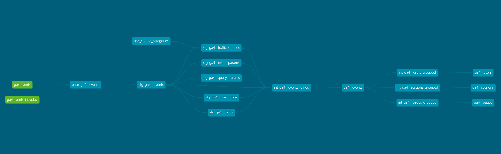

***NOTE: This project is still very much a work in progress, with much of the larger model restructuring still to come.***

# dbt GA4 Project
First and foremost, this project is based off of the dbt [GA4 Package by Velir](https://hub.getdbt.com/velir/ga4/latest), but has been modified and refactored for internal purposes.

This project uses [Google Analytics 4 BigQuery Exports](https://support.google.com/analytics/topic/9359001) as its source data, and offers useful base transformations to provide report-ready dimension & fact models that can be used for reporting purposes, blending with other data, and/or feature engineering for ML models.

Find more info about Google Analytics 4 BigQuery Exports [here](https://developers.google.com/analytics/bigquery).

## Style Guide:
This project and any future projects that may be based off of this intial `dbt_ga4_project`, will be following [This Project's Style Guide...IN PROGRESS](), which borrows ideals from the following Style Guides:
- [dbt's Style Guide](https://github.com/dbt-labs/corp/blob/main/dbt_style_guide.md)
- [GitLab's SQL Style Guide](https://about.gitlab.com/handbook/business-technology/data-team/platform/sql-style-guide)

# Models

<p align="center"><b><i> DAG Overview </b></i></p>



## Core Models
| Model Name | Description |
|------------|-------------|
| dim_ga4__users | This is the Dimension Table for user-level Dimensions, such as `first` & `last_seen_date`, `geo`, and `traffic_source`. This table is grouped by the hashed `user_key` dimension, which is based on `user_id`, or `user_pseudo_id` if one doesn't exist. | 
| dim_ga4__sessions | This is the dimension table for session-level dimensions, such as `landing_page`, `device`, and campaign-related attributes. |
| fct_ga4__pages | This is the Fact Table for page-related Metrics, such as `page_views`, `exits`, and `time_on_page`. This table is grouped by `page_title`, `event_date`, and `page_location`. |
| fct_ga4__sessions | This is the fact table for session-level metrics, such as `sessions_engaged`, `engagement_time`, and `page_views`. This table is grouped by both `session_key` and `user_key`. |

## Staging Models
| Model Name | Description |
|------------|-------------|
| stg_ga4__events | Creates a table with cleaned event data that is enhanced with useful `event_keys` and `session keys`. |
| stg_ga4__event_* | Creates a table per event that unnests all of the event parameters specific to that event (e.g. `page_view`, `click`, or `scroll`). |
| stg_ga4__event_items | Creates a table for all items associated with e-commerce events (e.g. `purchase`, `add to cart`, etc.). |
| stg_ga4__sessions_traffic_sources | Creates a table that designates a traffic source via the first `source`, `medium`, `campaign`, and `default_channel_grouping` for each session. |
| stg_ga4__session_conversions | Creates a session-based table for the events that you mark as being a `conversion_event`. |
| stg_ga4__event_to_query_string_params | Maps any and all query parameters (e.g. `metric_here`, `and_here`, etc.) that were contained in each event's `page_location`. |
| stg_ga4__user_properties | Creates a table that unnests the most recent GA4 `user_properties`, as well as any others  that you mark in `dbt_project.yml` file, for the purpose of including them in the final `dim_ga4_users` table. |
| stg_ga4__derived_user_properties | Creates a table of `derived_user_properties`, which are extracted from the `event_params` specified in the `dbt_project.yml` file,  for the purpose of including them in the final `dim_ga4_users` table. |
| stg_ga4__page_conversions | [REORDER THIS] ... ADD DESCRIPTION HERE ... |
| stg_ga4__sessions_first_last_pageviews | [REORDER THIS] ... ADD DESCRIPTION HERE ... |
| stg_ga4__users_first_last_pageviews | [REORDER THIS] ... ADD DESCRIPTION HERE ... |
| stg_ga4__users_first_last_events | [REORDER THIS] ... ADD DESCRIPTION HERE ... |

# Macros
| Macro Name | Description |
|------------|-------------|
| default_channel_groupings | This macro determines the `default_channel_grouping` dimension. |
| get_position | This macro returns either the `FIRST` or `LAST` position of a specified `from_column_name`, which is partioned by the `by_column_name`. |
| get_first | This macro returns the `FIRST` position of a specified `from_column_name`, which is partioned by the `by_column_name`. |
| get_last | This macro returns  the `LAST` position of a specified `from_column_name`, which is partioned by the `by_column_name`. |
| stage_custom_parameters | This macro stages any `custom_parameters` that you specify in the `dbt_project.yml` file, for the purpose of including them in the final `dim_ga4_users` table. |
| unnest_by_key | This macro unnests the specified `key_to_extract` from the `column_to_unnest`. |
| extract_hostname_from_url | This macro extracts the `hostname` from the `URL`. |
| extract_query_string_from_url | This macro extracts the `query_parameters` from the `URL`. |
| remove_query_parameters | This macro will remove any `query_parameters` from the `URL` that you specify in the `dbt_project.yml` file. |

# Seeds
| Seed File | Description |
|-----------|-------------|
| ga4_source_categories.csv| Google's mapping between `source` and `source_category`. More info and the download can be found [here](https://support.google.com/analytics/answer/9756891?hl=en) |

Make sure to run `dbt seed` before running `dbt run`.

# Installation & Configuration
## Setup

## Required Variables
This package assumes that you have an existing DBT project with a BigQuery profile and a BigQuery GCP instance available with GA4 event data loaded. Source data is located using the following variables which must be set in your `dbt_project.yml` file.
```
vars:
    ga4:
        project: "<gcp_project>" # Set your Project ID here.
        dataset: "<ga4_dataset>" # Set your Dataset name here.
        start_date: "YYYYMMDD"   # Set the start date that you want to retrieve data from.
        frequency: "daily"       # daily|streaming|daily+streaming Match to the type of export configured in GA4; daily+streaming appends today's intraday data to daily data.
```

If you don't have any GA4 data of your own, you can connect to Google's public data set with the following settings:
```
vars:
    project: "bigquery-public-data"
    dataset: "ga4_obfuscated_sample_ecommerce"
    start_date: "20210120"
```
Find more info about the GA4 obfuscated dataset [here](https://developers.google.com/analytics/bigquery/web-ecommerce-demo-dataset). 

## Optional Variables
### Query Parameter Exclusions
Setting any `query_parameter_exclusions` will remove query string parameters from the `page_location` field for all downstream processing. Original parameters are captured in a new `original_page_location` field. Ex:
```
vars:
  ga4: 
    query_parameter_exclusions: ["gclid","fbclid","_ga"] 
```

### Conversion Events
Specific event names can be specified as conversions by setting the `conversion_events` variable in your `dbt_project.yml` file. These events will be counted against each session and included in the `fct_sessions.sql` dimensional model. Ex:
```
vars:
  ga4:
      conversion_events:['purchase','download']
```

### Derived User Properties [TO HANDLE DIFFERENTLY]
Derived user properties are different from "User Properties" in that they are derived from event parameters. This provides additional flexibility in allowing users to turn any event parameter into a user property. 

Derived User Properties are included in the `dim_ga4__users` model and contain the latest event parameter value per user. 
```
derived_user_properties:
  - event_parameter: "[your event parameter]"
    user_property_name: "[a unique name for the derived user property]"
    value_type: "[string_value|int_value|float_value|double_value]"
```
For example: 
```
vars:
  ga4:
      derived_user_properties:
        - event_parameter: "page_location"
          user_property_name: "most_recent_page_location"  
          value_type: "string_value"
        - event_parameter: "another_event_param"
          user_property_name: "most_recent_param"  
          value_type: "string_value"
```

### Custom Parameters [TO REMOVE]
Within GA4, you can add custom parameters to any event. These custom parameters will be picked up by this package if they are defined as variables within your `dbt_project.yml` file using the following syntax:
```
[event name]_custom_parameters
  - name: "[name of custom parameter]"
    value_type: "[string_value|int_value|float_value|double_value]"
```
For example: 
```
vars:
  ga4:
    page_view_custom_parameters:
          - name: "clean_event"
            value_type: "string_value"
          - name: "country_code"
            value_type: "int_value"
```

### User Properties [TO REMOVE]
User properties are provided by GA4 in the `user_properties` repeated field. The most recent user property for each user will be extracted and included in the `dim_ga4__users` model by configuring the `user_properties` variable in your project as follows:
```
vars:
  ga4:
    user_properties:
      - user_property_name: "membership_level"
        value_type: "int_value"
      - user_property_name: "account_status"
        value_type: "string_value"
```

### GA4 Recommended Events [TO REMOVE]
See the README file at /dbt_packages/models/staging/ga4/recommended_events for instructions on enabling [Google's recommended events](https://support.google.com/analytics/answer/9267735?hl=en).

## Resources:
- GA4 Resources:
  - [GA4 BigQuery Export schema](https://support.google.com/analytics/answer/7029846?hl=en&ref_topic=9359001)
  - [Intro To GA4 in BQ](https://www.ga4bigquery.com/introduction-to-google-analytics-4-ga4-export-data-in-bigquery/)
- SQL & BigQuery Resources:
  - [BigQuery Docs](https://cloud.google.com/bigquery/docs)
  - [BigQuery: Functions, Operators, and Conditionals](https://cloud.google.com/bigquery/docs/reference/standard-sql/functions-and-operators)
  - [BigQuery: Query Syntax](https://cloud.google.com/bigquery/docs/reference/standard-sql/query-syntax)
  - [SQL Formatter](https://smalldev.tools/sql-formatter-online)
- dbt Resources:
  - [Getting Started with dbt Cloud](https://docs.getdbt.com/guides/getting-started)
    - [Getting Started with dbt Core](https://docs.getdbt.com/guides/getting-started/learning-more/getting-started-dbt-core)
    - [Refactoring legacy SQL to dbt](https://docs.getdbt.com/guides/getting-started/learning-more/refactoring-legacy-sql)
  - [Best Practices](https://docs.getdbt.com/guides/best-practices)
  - [GitLab's dbt Guide](https://about.gitlab.com/handbook/business-technology/data-team/platform/dbt-guide/)
  - [Jinja Template Designer Documentation](https://jinja.palletsprojects.com/en/3.1.x/templates)
- Project References:
  - [GA4 dbt Package](https://github.com/Velir/dbt-ga4.git)
  - [Stacktonic dbt Example Project](https://github.com/stacktonic-com/stacktonic-dbt-example-project)
  - Also inspired by [this](https://github.com/llooker/ga_four_block_dev/blob/master/views/sessions.view.lkml)
